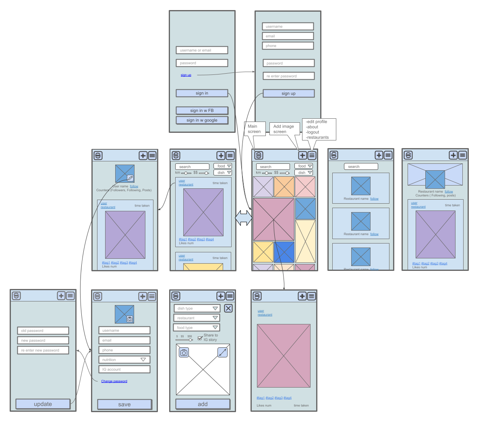

# FoodBook App

### => [Web](https://foodbook.onrender.com)

Are you tired of trying to decide what to order at a restaurant, but don't have any good photos to go off of? Look no further than Foodbook - the app for sharing and discovering dishes from restaurants. With Foodbook, you can browse through a variety of dishes from different restaurants, search for specific dishes or restaurants, and even share your own photos of restaurant dishes. Foodbook makes it easy to make informed decisions about what to eat, so you can focus on enjoying your meal.

## Motivation

Are you tired of trying to decide what to order at a restaurant, but don't have any good photos to go off of? Look no further than Foodbook - the app for sharing and discovering dishes from restaurants. With Foodbook, you can browse through a variety of dishes from different restaurants, search for specific dishes or restaurants, and even share your own photos of restaurant dishes. Foodbook makes it easy to make informed decisions about what to eat, so you can focus on enjoying your meal.

## Technology

Foodbook is built with a combination of `Nodejs`, `React` and `Express`, and uses `MongoDB` as the database. These technologies allow for a smooth and efficient user experience, as well as robust data storage and retrieval.

## Features

Browse through a diverse collection of restaurant dishes
Search for specific dishes or restaurants
Share your own photos of restaurant dishes
Discover new and exciting dishes from restaurants near you

## Flow Chart

## Demo

You can try my project at [Foodbook](https://foodbook.onrender.com).

## Contributing

We welcome any contributions to Foodbook. If you'd like to make a major change, please open an issue first to discuss your ideas.

## Available Scripts

In the project directory, you can run:

### `npm run dev`

<!-- 
https://www.youtube.com/watch?v=sEdxyZksgM8 -->
