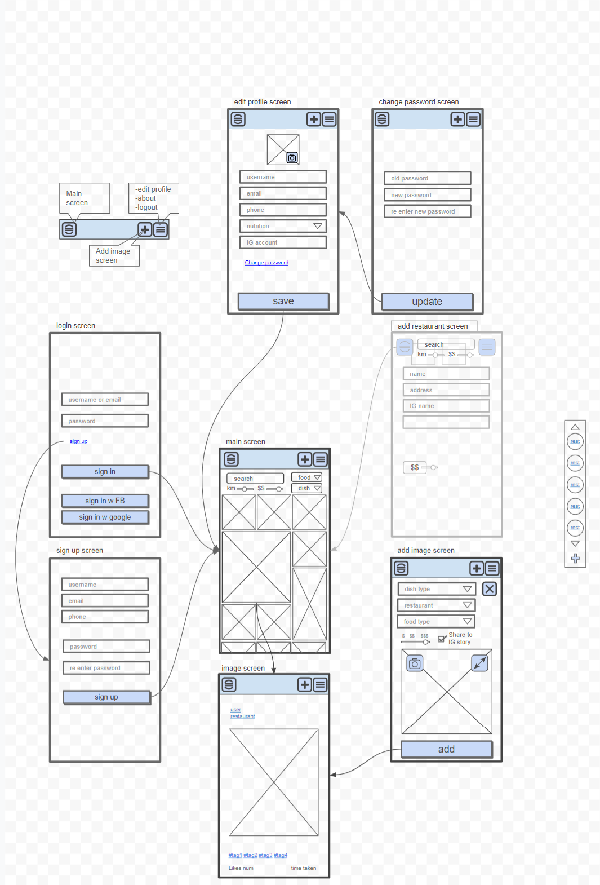

# FoodBook App

This app is for sharing images of dishes from restaurants

<!-- 
https://www.youtube.com/watch?v=sEdxyZksgM8 -->

You can try my project at [Foodbook](https://foodbook.onrender.com/).

This site is basically for people to see the dishes of the restaurant before they order it

This is my Flow Chart of the project

My motivation for this site came from the fact that when I'm in a restaurant I always try to look for pictures of the dishes before I order, and I don't always find

The main technologies of the site are `Nodejs` `React` `Express` and using with `MongoDB`

## Available Scripts

In the project directory, you can run:

### `npm run dev`
